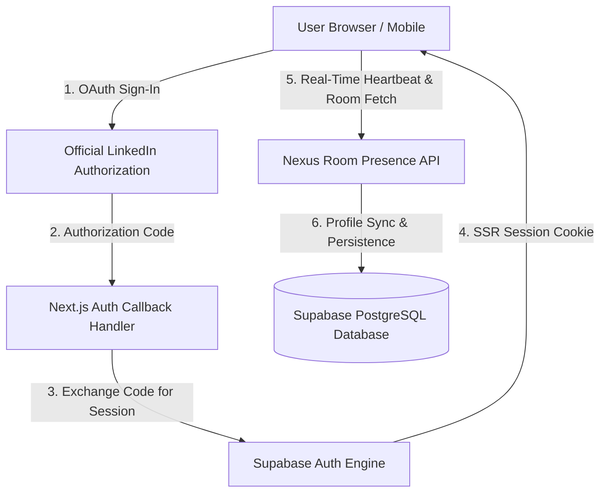

  <h1>🌐 Nexus — Real-Time Event Networking Platform</h1>
  
<strong>Never miss a high-value connection at hackathons, conferences, and tech meetups.</strong>

  

    
    
    
    
  

  

    <a href="#-live-application">Live Demo</a> •
    <a href="#-problem-statement">Problem</a> •
    <a href="#-key-features">Features</a> •
    <a href="#-architecture">Architecture</a> •
    <a href="#-tech-stack">Tech Stack</a> •
    <a href="#-contact">Contact</a>
  

  ---

## 🚀 Live Application

🔗 **Experience the Live Web Application**: **[https://join-nexus1.vercel.app](https://join-nexus1.vercel.app)**

> **Note**: Nexus is engineered for live events, hackathons, and conferences. Log in with your LinkedIn account to experience real-time attendee discovery and networking.

---

## 📌 Problem Statement

At modern tech events, conferences, and hackathons:
- **Networking is chaotic**: Attendees struggle to identify who is looking to hire, find co-founders, or join hackathon teams.
- **Lost Contacts**: Exchanging physical business cards or manually searching usernames on social media results in dropped follow-ups.
- **Fake & Incomplete Profiles**: Generic event platforms often suffer from inactive placeholder accounts or unverified identities.

---

## ✨ Key Features

### 🔐 1. Official LinkedIn OAuth 2.0 Verification
- **Verified Identities**: 1-tap authentication strictly via LinkedIn's official OAuth authorization endpoint.
- **Zero Mock Accounts**: Only real, verified LinkedIn users appear in event rooms.

### 📋 2. Tailored First-Time Onboarding
- **Goal-Driven Setup**: First-time attendees select their specific event objectives:
  - 🎓 **Internship Search**
  - 💼 **Job / Career Opportunities**
  - 🤝 **Co-founder & Startup Partners**
  - 🌐 **Tech Networking**
  - 👔 **Hiring & Talent Acquisition**
  - 💡 **Mentorship & Advising**
  - 🛠️ **Hackathon Collaboration**
- **Rich Profiles**: Auto-populates LinkedIn photo and name, capturing headline, organization, skills, and interests.

### 📡 3. Live Location-Aware Room Presence
- **Real-Time Attendee Discovery**: Discover all real attendees currently present in the same room across mobile and desktop devices.
- **Goal & Skill Filters**: Instant filtering by goal badges (`Looking For`) and skill tags.

### 🔗 4. Direct LinkedIn Profile Linking
- **1-Tap Profile Access**: Clicking **`View LinkedIn Profile ↗`** opens the attendee's authentic LinkedIn profile in a new tab for instant connection requests.

### 💬 5. Integrated 1-on-1 Direct Messaging
- **In-App Messaging**: Instant 1-on-1 chat drawer allowing attendees to communicate directly without leaving the event room.

### 👑 6. Founder & Admin Control Center
- **Event Operations**: Dedicated password-protected admin hub (`/admin`) for platform monitoring, feedback collection, and live user metrics.

---

## 🏗️ System Architecture

---

## 🛠️ Tech Stack

| Layer | Technology |
| :--- | :--- |
| **Framework** | [Next.js 14](https://nextjs.org/) (App Router, Server Components & Route Handlers) |
| **Language** | [TypeScript](https://www.typescriptlang.org/) (Strict Type Checking) |
| **Styling** | [Tailwind CSS](https://tailwindcss.com/) & Vanilla CSS Tokens |
| **Icons & UI** | [Lucide React](https://lucide.dev/), Custom Glassmorphism System |
| **State Management** | [Zustand](https://github.com/pmndrs/zustand) (Persistent Local & Auth State) |
| **Database & Auth** | [Supabase](https://supabase.com/) PostgreSQL & Supabase SSR Auth (LinkedIn OIDC) |
| **Deployment** | [Vercel](https://vercel.com/) (Serverless Edge Platform) |

---

## 🗺️ Product Roadmap

- [x] Official LinkedIn OAuth 2.0 Authentication
- [x] First-Time Profile Onboarding & Goal Badging
- [x] Multi-Device Real-Time Room Presence Engine
- [x] 1-on-1 In-App Direct Messaging
- [ ] 📱 QR Standee Venue Check-In Integration
- [ ] 🤖 AI Smart Attendee Matchmaker (Skill Complementarity Algorithm)
- [ ] 📅 Calendar Export for Post-Event Follow-Ups

---

## 📄 License

This repository is licensed under the **MIT License**. See [LICENSE](LICENSE) for details.

---

## 📬 Contact & Creator

**Anuj Vardham**  
Founder & Lead Engineer @ **Nexus**  
- **LinkedIn**: [linkedin.com/in/anuj-vardham-b399253a1](https://www.linkedin.com/in/anuj-vardham-b399253a1)  
- **Live Platform**: [join-nexus1.vercel.app](https://join-nexus1.vercel.app)

---

  Built with ❤️ by Anuj Vardham. Nexus &copy; 2025.

